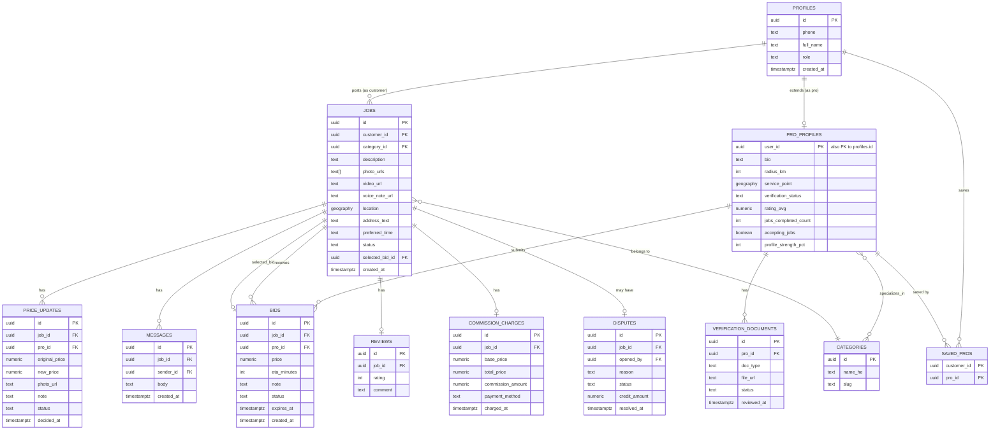

# ארכיטקטורה טכנית — Handy

מסמך זה הוא ה"איך" הטכני: הסטאק, מבנה הריפו, מודל הנתונים, והאינטגרציות החיצוניות. ההחלטות כאן "נעולות" (ראו גם `CLAUDE.md` סעיף 2) — המטרה היא שקלוד קוד לא יצטרך (ולא יהיה רשאי) להמציא אותן מחדש בכל שיחה.

## 1. סטאק טכנולוגי ולמה

| שכבה | טכנולוגיה | למה |
|---|---|---|
| Framework | Next.js 14+ (App Router, TypeScript) | ריפו אחד ל-frontend+backend, Server Actions מפשטים כתיבה מאובטחת, פריסה קלה ל-Vercel |
| DB + Auth + Storage + Realtime | **Supabase** (Postgres בבסיס) | פותר בבת אחת: DB יחסי מלא, אימות OTP בטלפון, אחסון קבצים (תמונות/סרטונים/מסמכים), ועדכונים בזמן אמת (הצעות שמגיעות, מיקום חי) — בלי לבנות שרת נפרד |
| שפה | TypeScript, `strict: true` בכל הריפו | בטיחות טיפוסים לאורך כל השכבות, כולל טיפוסים שנוצרים אוטומטית מסכימת ה-DB |
| עיצוב | Tailwind CSS | תואם את טוקני העיצוב שיוצאו מ-Claude Design |
| מפות/גיאולוקיישן | Google Maps Platform (Maps JS API, Geocoding, Places Autocomplete, Distance Matrix) | כיסוי טוב בישראל, תיעוד מלא, ספריות React מוכנות |
| מיקום גיאוגרפי ב-DB | **PostGIS** (extension של Postgres, זמין ב-Supabase) | שאילתות "בעלי מקצוע ברדיוס X ק״מ מנקודה" צריכות אינדקס גיאוגרפי אמיתי, לא חישוב מרחק ב-JS |
| הרשמה/כניסה | Supabase Auth — Phone + OTP, ספק SMS: **Twilio** (מוגדר בתוך Supabase Auth) | Supabase תומכת ב-Twilio באופן מובנה; אין צורך לבנות זרימת OTP בעצמנו |
| PDF (קבלות) | להחליט בשלב התשלומים/קבלות (ראו `CLAUDE.md` סעיף 9) | |
| Hosting | Vercel (Next.js) + Supabase Cloud | |
| בדיקות | Vitest (יחידה) + Playwright (E2E לזרימות קריטיות, מ-Phase 4 והלאה) | |

**החלטה חשובה:** אין שרת backend נפרד. כל הלוגיקה העסקית שרצה בצד שרת רצה כ-Next.js Server Actions / Route Handlers שמדברות עם Supabase, בתוספת Supabase Edge Functions למקומות שבהם נדרש טריגר מה-DB עצמו (למשל: שליחת התראה כשמתקבלת הצעה חדשה).

## 2. מבנה תיקיות

```
/app
  /(customer)/...           נתיבי לקוח: פרסום קריאה, מעקב, אזור אישי
  /(pro)/...                 נתיבי בעל מקצוע: פיד קריאות, הצעות, הכנסות
  /(admin)/...                לוח ניהול
  /(marketing)/...            עמודי SEO/תוכן ציבוריים
  /api/...                    Route Handlers (webhooks בלבד, ברירת מחדל היא Server Actions)
/components
  /ui                          קומפוננטות עיצוב גנריות
  /customer, /pro, /admin      קומפוננטות ספציפיות לתפקיד
/lib
  /supabase                    יצירת קליינט + טיפוסים מיוצרים אוטומטית מה-DB
  /validation                  סכמות Zod, קובץ אחד לכל ישות
  /actions                     Server Actions, מקובצים לפי ישות (jobs, bids, price-updates...)
  /maps                        עטיפות ל-Google Maps API (גיאוקוד, חישוב מרחק)
/supabase
  /migrations                  קבצי SQL — **מקור האמת היחיד** לסכימת ה-DB
  /seed.sql                    נתוני דמו לפיתוח מקומי
/docs                          מסמכי התכנון (התיקייה הזו)
```

**כלל ברזל:** כל שינוי סכימה עובר דרך קובץ migration חדש. שינוי ידני בממשק של Supabase שלא נלכד ב-migration = חוב טכני נסתר וגורם לקלוד קוד "לשכוח" את הסכימה האמיתית בין שיחות.

## 3. מודל הנתונים (טיוטת סכימה)

זו טיוטת ליבה למסד הנתונים, נגזרת מהעיצוב ומ-`product-spec.md`. השלב הראשון בפועל (Phase 1 ב-roadmap) יהפוך את זה למיגרציות SQL אמיתיות, כולל מדיניות RLS לכל טבלה.



### הערות מפתח למודל
- **`geography` (PostGIS point)** ב-`jobs.location` וב-`pro_profiles.service_point` — מאפשר שאילתת `ST_DWithin` יעילה ("כל בעלי המקצוע ברדיוס X מנקודה") עם אינדקס GiST, במקום לסרוק את כל הטבלה ולחשב מרחק ב-JS.
- **`bids.status`** כולל `pending / selected / rejected / expired` — פג תוקף מנוהל ע"י Edge Function מתוזמנת (cron) שרצה כל כמה דקות ומעדכנת הצעות שעברו 45 דקות.
- **`price_updates`** הוא הטבלה שאוכפת את חוק השקיפות: אין עמודת `price` ניתנת לעדכון ישיר בטבלת `jobs` — המחיר בפועל של קריאה הוא נגזרת (מחיר ההצעה שנבחרה + כל `price_updates` שאושרו).
- **`commission_charges`** נוצרת אוטומטית (טריגר DB או Server Action) עם סיום העבודה, ומחשבת 12% מהסכום הכולל.
- טבלת `notifications` תתווסף בשלב שבו בונים התראות בפועל (לא קריטית ל-Phase 1).

## 4. Row Level Security — עקרונות

RLS חובה בכל טבלה (ראו גם `CLAUDE.md` סעיף 3). כללי אצבע:

- **`jobs`**: לקוח רואה/עורך רק קריאות שהוא יצר. בעל מקצוע רואה קריאות בסטטוס `open`/`bidding` שבתחום/רדיוס שלו, ורואה קריאות שהוא זכה בהן. אדמין רואה הכל.
- **`bids`**: בעל מקצוע רואה/עורך רק את ההצעות שלו. לקוח רואה את כל ההצעות על הקריאות שלו (אבל לא יכול לערוך). אדמין רואה הכל.
- **`pro_profiles` / `verification_documents`**: בעל מקצוע רואה/עורך רק את הפרופיל שלו; המסמכים לא נגישים ללקוחות בשום מקרה (רק שדה `verification_status` נגזר, לא הקובץ עצמו). אדמין רואה הכל.
- **`commission_charges`**: בעל מקצוע רואה רק את שלו. אדמין רואה הכל. לקוח לא רואה בכלל (זה לא עניינו).

## 5. Realtime — מה רץ בזמן אמת

Supabase Realtime על גבי Postgres Changes + Broadcast:

| תרחיש | מנגנון |
|---|---|
| הצעות חדשות מגיעות למסך הלקוח | Postgres Changes subscription על `bids` מסונן ל-`job_id` |
| בעל מקצוע רואה קריאה חדשה בפיד | Postgres Changes על `jobs` (סטטוס `open`) + סינון בצד קליינט לפי רדיוס (או שאילתת PostGIS periodical) |
| מיקום חי של בעל מקצוע בדרך ("דוד בדרך אליך") | Broadcast channel `job:<id>:location`, בעל המקצוע משדר lat/lng כל כמה שניות בזמן שהסטטוס `assigned`/`in_progress` |
| התראה על עדכון מחיר | Postgres Changes על `price_updates` |
| צ'אט | Postgres Changes על `messages` מסונן ל-`job_id` |

## 6. אינטגרציות חיצוניות

- **Google Maps Platform**: Maps JavaScript API (הצגת מפה), Places Autocomplete (שדה כתובת בפרסום קריאה), Geocoding API (הפיכת כתובת לקואורדינטות שנשמרות ב-`jobs.location`), Distance Matrix/Directions (ניווט לבעל מקצוע). דורש API key בצד קליינט עם הגבלת דומיין ב-Google Cloud Console.
- **Twilio** (דרך Supabase Auth Phone Provider): שליחת קוד OTP. דורש הקמת חשבון Twilio + מספר שולח (לבדוק אילו מגבלות חלות על שליחת SMS לישראל דרך Twilio בזמן ההקמה).
- **Supabase Storage**: buckets נפרדים ל-`job-media` (תמונות/וידאו/קול של קריאות), `verification-docs` (מסמכי אימות — פרטי, לא ציבורי), `profile-photos`, `price-update-photos`. מדיניות גישה per-bucket תואמת ל-RLS.

## 7. משתני סביבה (יעודכן בפועל ב-`.env.example` בריפו)

```
NEXT_PUBLIC_SUPABASE_URL=
NEXT_PUBLIC_SUPABASE_ANON_KEY=
SUPABASE_SERVICE_ROLE_KEY=        # שרת בלבד, לעולם לא בצד קליינט
NEXT_PUBLIC_GOOGLE_MAPS_API_KEY=
TWILIO_ACCOUNT_SID=                # מוגדר בתוך Supabase Auth, לא בקוד שלנו ישירות
TWILIO_AUTH_TOKEN=
```

## 8. למה לא Prisma / למה לא backend נפרד

הוחלט (ראו שאלת ההבהרה עם המשתמש) על Supabase כדי לצמצם את כמות התשתית שצריך לבנות ולתחזק כפרויקט יחיד/צוות קטן. שימוש נוסף ב-Prisma מעל Supabase יוצר שני מקורות אמת לסכימה (migrations של Supabase מול Prisma schema) — נמנעים מזה. אם בעתיד יתברר שצריך backend נפרד (למשל עומס גבוה, לוגיקה מורכבת שלא מסתדרת טוב ב-Edge Functions), זו החלטה מודעת שדורשת עדכון של המסמך הזה, לא משהו שקלוד קוד מחליט תוך כדי עבודה.
