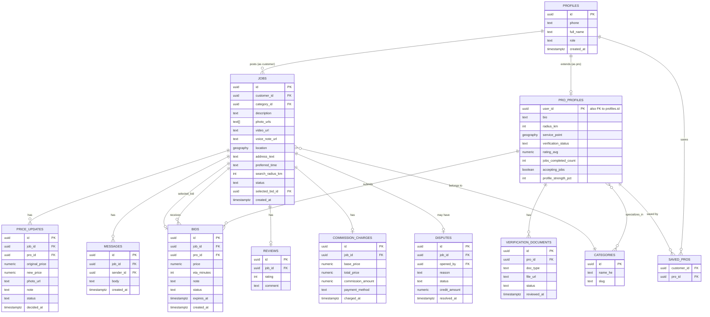

# ארכיטקטורה טכנית — Handy

מסמך זה הוא ה"איך" הטכני: הסטאק, מבנה הריפו, מודל הנתונים, והאינטגרציות החיצוניות. ההחלטות כאן "נעולות" (ראו גם `CLAUDE.md` סעיף 2) — המטרה היא שקלוד קוד לא יצטרך (ולא יהיה רשאי) להמציא אותן מחדש בכל שיחה.

## 1. סטאק טכנולוגי ולמה

| שכבה | טכנולוגיה | למה |
|---|---|---|
| Framework | Next.js 14+ (App Router, TypeScript) | ריפו אחד ל-frontend+backend, Server Actions מפשטים כתיבה מאובטחת, פריסה קלה ל-Vercel |
| DB + Auth + Storage + Realtime | **Supabase** (Postgres בבסיס) | פותר בבת אחת: DB יחסי מלא, אימות OTP בטלפון, אחסון קבצים (תמונות/סרטונים/מסמכים), ועדכונים בזמן אמת (הצעות שמגיעות, מיקום חי) — בלי לבנות שרת נפרד |
| שפה | TypeScript, `strict: true` בכל הריפו | בטיחות טיפוסים לאורך כל השכבות, כולל טיפוסים שנוצרים אוטומטית מסכימת ה-DB |
| עיצוב | Tailwind CSS | תואם את טוקני העיצוב שיוצאו מ-Claude Design |
| מפות/גיאולוקיישן | Google Maps Platform (Maps JS API, Geocoding, Places Autocomplete, Distance Matrix) | כיסוי טוב בישראל, תיעוד מלא, ספריות React מוכנות |
| מיקום גיאוגרפי ב-DB | **PostGIS** (extension של Postgres, זמין ב-Supabase) | שאילתות "בעלי מקצוע ברדיוס X ק״מ מנקודה" צריכות אינדקס גיאוגרפי אמיתי, לא חישוב מרחק ב-JS |
| הרשמה/כניסה | Supabase Auth — Phone + OTP, ספק SMS: **Twilio** (מוגדר בתוך Supabase Auth) | Supabase תומכת ב-Twilio באופן מובנה; אין צורך לבנות זרימת OTP בעצמנו |
| PDF (קבלות) | **`@react-pdf/renderer`** + פונט Heebo (TTF) שמאוחסן בריפו ב-`assets/fonts/` | הוכרע ב-Phase 6. קבלה בעברית היא בעיית **bidi**, לא בעיית פונט: ל-PDF אין מנוע דו-כיווניות משלו, ולכן כותב קל יותר (pdf-lib, pdfkit) היה מחייב היפוך ידני של רצפים עבריים. הספרייה הזו פורסת טקסט דרך textkit שעושה את זה, ומקבלת TTF — מה שעברית דורשת |
| Hosting | Vercel (Next.js) + Supabase Cloud | |
| בדיקות | pgTAP לכל מה שתלוי ב-RLS · Vitest (יחידה, הוקם ב-Phase 2) · Playwright (E2E לזרימות קריטיות, מ-Phase 9) | `npm run db:test` / `npm run test`. הכלל: מדיניות RLS נבדקת במסד הנתונים שבו היא רצה, לא במוק ב-JS |

### גרסאות בפועל (הותקנו ב-Phase 0)

Next **16.3.4** · React **19.2.8** · Tailwind **4.3.3** · TypeScript 5 · `@supabase/supabase-js` **2.112.4** · `@supabase/ssr` **0.12.5** · Supabase CLI **2.116.0** (devDependency, מורץ ב-`npx supabase`) · PostGIS **3.3** (בסטאק הלוקאלי).

שתי נקודות שנובעות מהגרסאות האלה ושלא היו במסמך המקורי:

1. **Tailwind v4 הוא CSS-first — אין `tailwind.config.ts`.** טוקני העיצוב מ-Claude Design נכנסים לבלוק `@theme` בתוך `app/globals.css`. שם מחפשים אותם, לא בקובץ קונפיג. הטוקנים עצמם נדגמו ב-Phase 2 ישירות מה-PNG-ים ב-`design/screens/` (כל מסך מדפיס את אותן חמש דגימות עם מקרא), והם מוגדרים לפי **תפקיד ולא לפי צבע** — `--color-cta` ולא `--color-emerald`: כחול = צד הלקוח, אינדיגו = צד בעל המקצוע, אמרלד = פעולה ראשית, כתום = עדכון מחיר בשטח, `#0f172a` = דיו.
2. **`CLAUDE.md` ותיקיית `docs/` מוחרגות מ-Prettier** (ב-`.prettierignore`). Prettier מרפד תאי טבלה במרקדאון לפי רוחב תווים לטיניים, מה שהורס את היישור של טבלאות עבריות דו-כיווניות ומשכתב את המסמכים בכל הרצה.

### RTL — כלל מחייב

האפליקציה מרונדרת `<html lang="he" dir="rtl">` עם הפונט Heebo. **כל** מרווח/מיקום נכתב ב-logical properties של Tailwind (`ms-`/`me-`/`ps-`/`pe-`/`start-`/`end-`) ולא בפיזיים (`ml-`/`mr-`/`left-`/`right-`). ראו `CLAUDE.md` סעיף 3.

### פורטים לוקאליים

הסטאק הלוקאלי רץ על **5442x** במקום ברירת המחדל של Supabase (5432x), כדי שאפשר יהיה להריץ אותו במקביל לפרויקטי Supabase אחרים על אותה מכונה בלי התנגשות פורטים. מוגדר ב-`supabase/config.toml`, מתועד ב-`README.md`.

**החלטה חשובה:** אין שרת backend נפרד. כל הלוגיקה העסקית שרצה בצד שרת רצה כ-Next.js Server Actions / Route Handlers שמדברות עם Supabase, בתוספת Supabase Edge Functions למקומות שבהם נדרש טריגר מה-DB עצמו (למשל: שליחת התראה כשמתקבלת הצעה חדשה).

## 2. מבנה תיקיות

```
/app
  /(customer)/...           נתיבי לקוח: פרסום קריאה, מעקב, אזור אישי
  /(pro)/...                 נתיבי בעל מקצוע: פיד קריאות, הצעות, הכנסות
  /(admin)/...                לוח ניהול
  /(marketing)/...            עמודי SEO/תוכן ציבוריים (Phase 8) — כולם ללא סשן
  /robots.ts, /sitemap.ts     מה שסורק מנוע חיפוש מקבל (Phase 8)
  /api/...                    Route Handlers (webhooks בלבד, ברירת מחדל היא Server Actions)
/components
  /ui                          קומפוננטות עיצוב גנריות
  /customer, /pro, /admin      קומפוננטות ספציפיות לתפקיד
/lib
  /supabase                    יצירת קליינט + טיפוסים מיוצרים אוטומטית מה-DB
  /content                     תוכן עריכתי בקוד (Phase 8): ערים, קופי לתחומים,
                               שאלות נפוצות, מדריכים, טקסטים משפטיים
  /seo.tsx                     canonical, מטא-תגיות ו-JSON-LD
  /validation                  סכמות Zod, קובץ אחד לכל ישות
  /actions                     Server Actions, מקובצים לפי ישות (jobs, bids, price-updates...)
  /maps                        עטיפות ל-Google Maps API (גיאוקוד, חישוב מרחק)
  /pdf                         מסמך הקבלה (Phase 6). server-only, נגיש רק מה-Route Handler
/assets/fonts                  קובצי ה-TTF של Heebo שה-PDF מטמיע. לא ב-`public/`:
                               הם לא מוגשים לדפדפן לעולם (האפליקציה מקבלת Heebo
                               מ-next/font/google) ונקראים ב-`fs` בזמן בקשה
/supabase
  /migrations                  קבצי SQL — **מקור האמת היחיד** לסכימת ה-DB
  /tests                       pgTAP — טענות על מדיניות RLS
  /seed.sql                    נתוני דמו לפיתוח מקומי
/docs                          מסמכי התכנון (התיקייה הזו)
```

**כלל ברזל:** כל שינוי סכימה עובר דרך קובץ migration חדש. שינוי ידני בממשק של Supabase שלא נלכד ב-migration = חוב טכני נסתר וגורם לקלוד קוד "לשכוח" את הסכימה האמיתית בין שיחות.

## 3. מודל הנתונים (טיוטת סכימה)

זו טיוטת ליבה למסד הנתונים, נגזרת מהעיצוב ומ-`product-spec.md`. השלב הראשון בפועל (Phase 1 ב-roadmap) יהפוך את זה למיגרציות SQL אמיתיות, כולל מדיניות RLS לכל טבלה.



### סטיות מהטיוטה — מה שנבנה בפועל ב-Phase 1

הסכימה למעלה היא הטיוטה המקורית. אלה ההבדלים בין הטיוטה למיגרציות שנכתבו בפועל (`supabase/migrations/2026090112*`):

| שינוי | למה |
|---|---|
| **`commission_charges.pro_id` נוסף** | בטיוטה בעל המקצוע נגזר דרך `job → selected_bid → pro`. מדיניות RLS של "בעל מקצוע רואה רק את ההכנסות שלו" הייתה הופכת ל-join דו-שלבי שמורץ על כל שורה — גם איטי וגם קשה לביקורת. עמודה מפורשת = השוואת עמודה אחת מאונדקסת. |
| **`bids`: `unique (job_id, pro_id)`** | הצעה אחת לכל בעל מקצוע לכל קריאה. |
| **`reviews`: `unique (job_id)`** | ה-ERD מגדיר `JOBS ||--o| REVIEWS` — נאכף בפועל. |
| **`price_updates.photo_url`: `not null` + `check` על מחרוזת לא ריקה** | חוק השקיפות הוא אילוץ במסד הנתונים, לא שדה חובה בטופס שאפשר לעקוף. |
| **סטטוסים כ-`text` + `check`, לא `enum` של Postgres** | תואם לטיוטה, ומאפשר להוסיף סטטוס בשלב עתידי בלי `ALTER TYPE`. |
| **פונקציות עזר ל-RLS** (`auth_role`, `is_admin`, `is_verified_pro`, `is_job_owner`, `is_assigned_pro`, `is_bidding_pro`, `pro_serves_point` — הוחלפה ב-Phase 3 ב-`pro_serves_job`) | כולן `security definer` עם `search_path` ריק. בלי `security definer`, מדיניות על `jobs` שקוראת `profiles` מפעילה את המדיניות של `profiles` וגורמת לרקורסיה. |
| **הרשאות ברמת עמודה (`grant update (col) ...`), לא רק RLS** | RLS בוחרת **שורות** ולא עמודות. מדיניות "מותר לך לעדכן את השורה שלך" הייתה מאפשרת ללקוח לשנות `role` שלו ל-`admin`, ולבעל מקצוע לשנות `verification_status` ו-`rating_avg` של עצמו. ה-grant הצר הוא מה שחוסם את זה בפועל. |
| **טריגר `handle_new_user` עם whitelist על ה-role** | `raw_user_meta_data` הוא קלט מהדפדפן — מה שנשלח ב-`options.data` מגיע כמו שהוא. רק `customer`/`pro` מכובדים; `admin` ניתן רק ב-SQL ישיר. |
| **`notifications`** — לא נוצרה | כפי שהטיוטה קובעת: תתווסף בשלב שבו בונים התראות. |
| **Storage buckets** — לא נוצרו | מופיעים בסעיף 6, אבל שייכים לשלב שמעלה קבצים בפועל (Phase 2/3), לא ל-Phase 1. |

**מה שלא נבנה ב-Phase 1 בכוונה:** מכונת המצבים של `price_updates` (`pending → approved/rejected`) והמחיר הנגזר — זהו Phase 5. ב-Phase 1 קיימים הטבלה, האילוצים והמדיניות בלבד.

### מה נוסף ב-Phase 2 (`supabase/migrations/2026090212*`)

| שינוי | למה |
|---|---|
| **`jobs.search_radius_km`** (`default 5`, `check 1..50`) | `product-spec.md` 3.2 נותן ללקוח לבחור רדיוס חיפוש בשלב הכתובת, וחוק עסקי 7 קובע ברירת מחדל של 3–5 ק״מ. זו ההעדפה של הלקוח בלבד; השער בפועל על הפיד נשאר `pro_serves_point` — הרדיוס של בעל המקצוע. איך השניים מצטלבים הוכרע ב-Phase 3: `least()` של השניים, ראו למטה. |
| **`jobs.preferred_time` קיבל `check`** (`asap`/`today`/`tomorrow`/`this_week`/`flexible`) | כטקסט חופשי, ה-UI לא יכול לרנדר את הערך בעברית — הוא רק מהדהד את מה שנשמר. הטופס מציע בחירה סגורה, ולכן העמודה מחזיקה slug באנגלית והתוויות חיות ב-`lib/validation/jobs.ts`. |
| **`jobs.latitude` / `jobs.longitude`** — עמודות `generated always as ... stored` | PostgREST מחזיר `geography` כ-hex EWKB. בלי הנגזרות האלה כל מסך שרוצה להראות ללקוח איפה הכתובת שלו נחתה היה צריך לפענח EWKB ב-JS. שתי הפונקציות immutable, ו-`location` נשאר מקור האמת היחיד. |
| **bucket `job-media` (פרטי) + 4 מדיניות על `storage.objects`** | תמונות/וידאו/הקלטה של קריאה. פריסה: `<customer_id>/<upload_group>/<filename>` — הקבצים עולים בזמן שהקריאה עוד ממולאת, לפני שיש `job_id`. ההעלאה נעולה לתיקייה של המעלה ולתפקיד `customer`; אין מדיניות `update` בכלל (קובץ מוחלף בהעלאה חדשה, לא משתנה במקום). |
| **`public.can_read_job_media(text)`** — `security definer` | התאום של מדיניות ה-`select` על `jobs`, בצד ה-Storage: בעל הקריאה, אדמין, בעל מקצוע מאומת שהקריאה בתוך הרדיוס שלו, מי שהגיש הצעה, ומי שנבחר. אם המדיניות על `jobs` משתנה — הפונקציה הזו משתנה איתה. |

**נתיבי מדיה נשמרים כ-object paths, לא כ-URL-ים.** ה-bucket פרטי, וכל צפייה עוברת signed URL שנחתם בשרת תחת ה-RLS של הקורא — Storage לא חותם נתיב שהקורא לא היה יכול לקרוא ממילא.

**מדיה עולה ישירות מהדפדפן ל-Storage**, לא דרך Server Action: סרטון של 30 שניות הוא עשרות מגה-בייט, הרבה מעבר למגבלת הגוף של Server Action. הטופס שולח לשרת נתיבים, וה-Zod schema מוודא שכל נתיב יושב בתיקייה של המשתמש שמפרסם — אותו דבר שמדיניות ה-`insert` של ה-bucket אוכפת, פעמיים.

### מה נוסף ב-Phase 3 (`supabase/migrations/20260903120000_pro_onboarding.sql`)

| שינוי | למה |
|---|---|
| **`pro_profiles`: `work_days`, `work_start_time`, `work_end_time`, `service_address_text`, `onboarding_step`, `submitted_at`, `payment_methods`, `payout_bank_name`, `payout_bank_branch`, `payout_account_last4`** | מה שחמשת שלבי ה-Onboarding אוספים (`product-spec.md` 4.2) ומה שמסך הזמינות עורך (4.9). `service_address_text` הוא הכתובת שהוקלדה; `service_point` הוא הגיאוקוד שלה — רדיוס בלי מרכז אינו שאילתת PostGIS. |
| **`verification_status` קיבל מצב `draft`, והוא ברירת המחדל** | ב-Phase 1 בעל מקצוע חדש נולד `pending`, ולכן "עוד לא מילא כלום" ו"ממתין לצוות Handy" היו אותו ערך. הגדרת הסיום של Phase 3 היא בדיוק שבעל מקצוע **מגיע** ל-`pending` בסוף חמשת השלבים. |
| **`pro_categories`** (טבלה חדשה) | קשת ה-`specializes_in` שב-ERD. הפיד משתמש בה כמסנן ולא כגבול אבטחה: קריאה בתוך הרדיוס אינה סוד מבעל המקצוע רק בגלל שהיא בתחום אחר, ולכן השער נשאר רדיוס+מאומת והצמצום לפי תחום חי בשאילתת הפיד. |
| **`job_dismissals`** (טבלה חדשה) | כפתור "לא מתאים לי" בכל כרטיס בפיד. טבלה ולא הסתרה בצד לקוח, כדי שהסתרה בטלפון תישמר גם במחשב. אינה מסתירה דבר מאיש אחר ואינה מעניקה הרשאה. |
| **`submit_pro_for_approval()` ו-`set_pro_verification()`** — `security definer` | שני המעברים החוקיים של `verification_status`. RLS בוחרת שורות ולא עמודות, ולכן grant רחב מספיק לאדמין היה מאפשר גם לבעל מקצוע לאמת את עצמו. אין ולו grant אחד על העמודה הזו לשום client role; הפונקציות בודקות את הקורא בעצמן. `submit_pro_for_approval` גם בודקת שלמות (תחום, כתובת בסיס, ת.ז) — שאלה שטופס אינו יכול להיות מהימן לענות עליה. |
| **`pro_serves_job(point, search_radius_km)` מחליפה את `pro_serves_point(point)`** | ההכרעה ש-Phase 2 השאירה פתוחה. ראו למטה. |
| **`open_jobs_for_pro(p_max_km)`** — `security invoker` | שאילתת הפיד: `ST_DWithin` מאונדקס מול ה-`service_point` של בעל המקצוע, עם `ST_Distance` למרחק שמוצג בכרטיס. רצה כקורא, ולכן המדיניות על `jobs` היא שבוחרת את השורות והפונקציה רק מצמצמת. |
| **`job_bid_count(uuid)`** — `security definer` | העיצוב מציג "כמה הצעות כבר הוגשו" בכל כרטיס, אבל מדיניות ה-`select` על `bids` מראה לבעל מקצוע רק את השורות שלו. פונקציה שמחזירה מספר בלבד — בלי מחירים ובלי זהויות — במקום להרחיב את המדיניות. |
| **bucket `verification-docs` (פרטי) + 3 מדיניות** | ת.ז, רישיון, ביטוח ותמונת פרופיל. בניגוד ל-`job-media` אין כאן שום נתיב "מישהו אחר רואה דרך שורה קשורה": `product-spec.md` 4.2 מפורש שהמסמכים לא מוצגים ללקוחות, שרואים רק את התג הנגזר. בדיוק שני קוראים — בעל המקצוע שהעלה, ואדמין. אין `update` ואין `delete`: מסמך מוחלף בהעלאה חדשה, כך שדחייה לא נמחקת בשקט. |

**שני הרדיוסים חייבים להסכים.** `jobs.search_radius_km` (עד כמה הלקוח ביקש לשדר) ו-`pro_profiles.radius_km` (עד כמה בעל המקצוע מוכן לנסוע) נפגשים ב-`least()`: קריאה נראית רק במרחק `least(radius_km, search_radius_km)`. האכיפה היא **במדיניות ה-RLS** ולא בשאילתה, כדי שהיא תחול על כל דבר שיקרא אי פעם את הטבלה — כולל `can_read_job_media`, שעודכן איתה. `supabase/tests/rls_test.sql` מוכיח את זה עם זוג קריאות זהות באותה נקודה בדיוק, שנבדלות רק ב-`search_radius_km`.

**רק 4 ספרות של חשבון הבנק נשמרות.** `payout_account_last4` מספיק כדי שבעל המקצוע יזהה את החשבון על המסך. איסוף מספר החשבון המלא נוגע בתנועת כסף אמיתית, ולפי `CLAUDE.md` סעיף 8 זו החלטה שמתקבלת עם המשתמש — בשלב התשלומים, לא כאן.

### מה נוסף ב-Phase 4 (`supabase/migrations/20260904120000_realtime_bidding.sql`)

| שינוי | למה |
|---|---|
| **`bids`: INSERT מצומצם לעמודות** (`job_id, pro_id, price, eta_minutes, note`), ו-`status` איבד את ה-UPDATE grant | ב-Phase 1 ה-grant היה על השורה כולה, כלומר בעל מקצוע יכול היה לקבוע לעצמו `expires_at` בעוד שנה (הצעה שלא פגה לעולם) ולסמן את ההצעה שלו כ-`selected`. שתי העמודות האלה נשארות לברירות המחדל ולפונקציות. |
| **`bids_guard_update` (טריגר)** | הצעה שכבר הוכרעה או שפג תוקפה אינה ניתנת לעריכה — תמחור מחדש של הצעה שהלקוח כבר פעל לפיה הוא שכתוב היסטוריה. שינוי מחיר/זמן/הערה בהצעה חיה מאפס את 45 הדקות, כי חוק עסקי 6 מודד תוקף מרגע ההצעה וזו הצעה חדשה. |
| **`can_bid_on_job(job_id)`** ובמדיניות ה-INSERT | מדיניות Phase 1 שאלה רק "אתה בעל מקצוע מאומת שכותב את ה-`pro_id` של עצמך", מה שהתיר הצעה על **כל** `job_id` — גם מחוץ לרדיוס וגם על קריאה שכבר שובצה. עכשיו ההגשה מגיעה בדיוק עד לאן שהפיד מגיע. |
| **`select_bid(bid_id)`** — `security definer`, ו-`jobs` איבד `update (status, selected_bid_id)` | זהו מסלול כסף: המחיר המוסכם של קריאה הוא מחיר ההצעה שנבחרה, ולכן קליינט שיכול לכתוב `selected_bid_id` יכול לבחור הצעה שפג תוקפה, הצעה על קריאה של מישהו אחר, או לבחור מחדש בדיעבד. הפונקציה בודקת בעלות, שהקריאה עדיין פתוחה ושההצעה לא פגה — ואז נועלת את כל ההצעות היריבות ומשבצת את הקריאה, הכל בהצהרה אחת. |
| **`expire_stale_bids()` + `pg_cron` כל דקה** | חוק עסקי 6. ה-sweep הוא ניקיון בלבד: `select_bid()` קוראת את השעון בעצמה, ופונקציות הקריאה מדווחות הצעה שפגה כ-`expired` בין אם ה-sweep רץ ובין אם לא. ה-`do` block עוטף את ה-cron בטיפול חריגה, כי הנכונות אינה תלויה בו — ובנוסף מסכי הקריאה קוראים ל-sweep בעצמם. |
| **`messages.pro_id` (+`read_at`)** | שיחה היא (קריאה, בעל מקצוע), לא (קריאה). המדיניות של Phase 1 התירה לכל בעל מקצוע שהגיש הצעה לקרוא את ההודעות של הקריאה — כלומר בקריאה עם שלוש הצעות, כל אחד מהם קרא את שתי השיחות האחרות. `read_at` נותן למחווני "לא נקרא" שבעיצוב נתונים אמיתיים, וניתן לכתיבה רק על ידי הצד שלא שלח. |
| **`bids_for_job`, `my_bids`, `my_bid_stats`, `pros_in_range`, `similar_bid_range`, `my_message_threads`, `thread_messages`** — `security definer` | מסך השוואת ההצעות צריך שם, דירוג ומספר עבודות ליד כל מחיר, ול-`profiles`/`pro_profiles` אין (ובכוונה) מדיניות קריאה ללקוחות. התשובה הנכונה ל"המסך צריך ארבע עמודות" היא פונקציה שמחזירה בדיוק את הארבע, לא מדיניות שפותחת את הטבלאות. אותו שיקול בדיוק כמו `job_bid_count` ב-Phase 3. |
| **`jobs`: מדיניות "bidding pro reads a job they bid on"** | ברגע ששיבצו קריאה היא יוצאת מהמדיניות של "פתוחה ברדיוס", ואז "ההצעות שלי" היה מציג הצעות מול שורות ריקות. |
| **פרסום `bids`, `messages`, `jobs` ל-`supabase_realtime`** | סעיף 5 של המסמך הזה. Realtime מחיל את ה-RLS של כל מנוי לפני שהוא מוסר שורה, ולכן הפרסום אינו מרחיב דבר. |

**`my_bids().winning_price` — מה נחשף למי שלא נבחר.** העיצוב (`pro-2.4-my-bids.png`) מציג "הלקוח בחר אחר (280 ₪)". המדיניות על `bids` מראה לבעל מקצוע רק את השורות שלו, ולכן המספר מגיע מהפונקציה — **המחיר בלבד, אף פעם לא הזהות שמאחוריו**. זו אותה עסקה ש-`job_bid_count` עושה כשהיא מספרת לבעל מקצוע שיש תחרות בלי לנקוב בשמה.

**Realtime בדפדפן חייב לקבל את הטוקן לפני ה-join.** האפליקציה משחזרת סשן מ-cookie ולא מתחברת בצד לקוח, ולכן שום אירוע אימות לא דוחף את הטוקן ל-realtime client וה-`phx_join` מקדים את חיפוש הטוקן. סוקט לא מאומת אינו "רואה פחות שורות" — הוא **נדחה כליל** עם `invalid column for filter job_id`, כי ל-`anon` אין הרשאה על הטבלאות האלה ולכן הוא לא רואה את העמודה שמבקשים לסנן לפיה. `components/ui/RealtimeRefresh.tsx` קורא `setAuth()` ורק אז `subscribe()`.

**מה ה-subscription מעביר לדף: כלום.** הוא רק אומר לראוטר שהתשובה של השרת התיישנה, והשרת מרנדר מחדש תחת ה-RLS של הקורא. מה שמגיע למסך הוא בדיוק מה שרענון היה מראה, ולכן payload שנמסר בטעות לא יכול היה להרחיב את מה שמוצג. הצעה היא כסף, והסמכות עליה היא מסד הנתונים — לא הודעה שישבה בטאב.

### מה נוסף ב-Phase 5 (`supabase/migrations/20260905120000_live_tracking_price_updates.sql`)

| שינוי | למה |
|---|---|
| **`job_effective_price(job_id)`** — `security definer` | המחיר החי של קריאה: מחיר ההצעה שנבחרה, ומוחלף ב-`new_price` של עדכון המחיר המאושר האחרון. ל-`jobs` אף פעם לא הייתה עמודת מחיר, ולכן זו לא "עוד דרך" לקרוא את המחיר — זו הדרך היחידה. בקשה שממתינה או שנדחתה אינה מופיעה בה בכלל, וזה כל "אם הלקוח לא מאשר — העבודה ממשיכה במחיר המקורי": אין מקום שבו מספר לא מאושר יכול לשבת, ולכן שום קוד לא צריך לזכור להתעלם ממנו. |
| **`request_price_update()` מחליפה את ה-INSERT הישיר**, ו-`price_updates` איבד את grant ה-INSERT | ב-Phase 1 ה-grant היה על השורה כולה, כלומר בעל המקצוע הצהיר בעצמו על `original_price` — שדה כסף. עכשיו הפונקציה קוראת אותו מ-`job_effective_price()`, ומוודאת שהתמונה יושבת ב-`<pro_id>/<job_id>/…` — כך שאי אפשר למחזר תמונה של תקלה אחת כראיה לקריאה אחרת. |
| **`decide_price_update()` מחליפה את `update (status, decided_at)`** | ה-grant של Phase 1 איפשר ללקוח לאשר, לדחות ואז לאשר שוב — תמחור מחדש רטרואקטיבי של עבודה שהסתיימה. הפונקציה מזיזה `pending` לאחד משני מצבים סופיים, פעם אחת. |
| **`price_updates_guard_update` (טריגר) + אילוצים** | הטריגר אוסר לשנות שורה שכבר הוכרעה, ואוסר לשנות סכומים, תמונה או הערה אחרי היצירה — **גם לקורא שעוקף RLS לגמרי**, כי טריגר רץ מתחת למדיניות ולא מעליה. בנוסף: `new_price > 0`, `new_price <> original_price`, ו-unique חלקי שמונע יותר מבקשה אחת ממתינה לקריאה. |
| **`job_locations`** (טבלה חדשה) + **`report_job_location()`** | ראו למטה — הסטייה מסעיף 5 של המסמך הזה. |
| **`mark_job_in_progress()`** | `assigned → in_progress`, על ידי בעל המקצוע המשובץ בלבד, בכיוון אחד, אידמפוטנטית. `jobs.status` איבד את ה-grant שלו ב-Phase 4, ולכן כל מעבר נוסף מגיע כפונקציה בדוקה. סיום העבודה (`completed`) שייך ל-Phase 6 יחד עם רשומת העמלה והקבלה שהוא חייב ליצור. |
| **`job_contact(job_id)`** — `security definer` | שני העיצובים מציגים כפתור "חיוג ☎". מספר טלפון יושב ב-`profiles`, שאין לו מדיניות קריאה בין משתמשים ואסור שתהיה לו: המספר אינו ציבורי, הוא נחשף מעצם זה ששני האנשים האלה חולקים עבודה משובצת. הפונקציה מחזירה שם ומספר של הצד השני, ותו לא. |
| **`my_active_jobs()`** — `security definer` | `design/screens/pro-3.2-my-jobs.png`, לשונית "פעילות". `current_price` מגיע מ-`job_effective_price()`, ולכן בקשה שהלקוח לא ענה עליה לא מופיעה כאן ככסף. לשונית ההיסטוריה והקבלות היא Phase 6. |
| **bucket `price-update-photos` (פרטי) + 3 מדיניות** | כמו `verification-docs`, ובדיוק מאותה סיבה: **אין `update` ואין `delete`**. זו הראיה שעל בסיסה הלקוח אישר מחיר גבוה יותר, וראיה שאפשר להחליף בדיעבד אינה ראיה. הלקוח רואה את הקובץ דרך `can_read_price_update_photo()` — כלומר בדיוק כשקיימת שורת `price_updates` שמצביעה עליו. |
| **פרסום `price_updates` ו-`job_locations` ל-`supabase_realtime`** | כרטיס האישור חייב לעלות אצל הלקוח ברגע שנשלח, והתשובה חייבת לרדת אצל בעל המקצוע ברגע שניתנה. Realtime מחיל את ה-RLS של כל מנוי לפני מסירת שורה, ולכן הפרסום אינו מרחיב דבר. |

**מיקום חי הוא טבלה, לא broadcast — סטייה מסעיף 5 של המסמך הזה.** הטיוטה תיארה ערוץ `job:<id>:location` שאליו בעל המקצוע משדר lat/lng. `job_locations` מחליף אותו, משתי סיבות. הראשונה: broadcast לא משאיר כלום למי שפותח את המסך באמצע הנסיעה — הלקוח רואה מפה ריקה עד ה-ping הבא. השנייה, והמכריעה: השאלה "מי רשאי לראות איפה בעל המקצוע נמצא עכשיו" הופכת אז לאישור הצטרפות לערוץ, במקום למדיניות על טבלה ש-`supabase/tests/rls_test.sql` יכול להוכיח עליה טענות. הסוויטה אכן מוכיחה: לקוח אחר לא רואה את הפין, ובעל מקצוע יריב שהגיש הצעה על אותה קריאה לא יכול לעקוב אחרי מי שזכה בה.

**המחיר של הבחירה הזו הוא כתיבה אחת ל-ping במקום fan-out בלי כתיבה, והוא חסום בכוונה:** שורה אחת לכל קריאה (אין היסטוריה שתגדל), `LOCATION_REPORT_INTERVAL_MS` הוא 15 שניות, והדפדפן מדווח רק כשהטאב פתוח, רק כשהקריאה `assigned`/`in_progress`, ורק אחרי שבעל המקצוע הדליק את המתג בעצמו. נסיעה של 40 דקות עולה כ-160 upsert-ים לשורה אחת שנדרסת בכל פעם. `watchPosition` מספק את הקריאות (זה ה-API שמתעורר על תנועה ולא על טיימר), אבל הן **נשלחות** לפי הטיימר — עמידה ברמזור לא עולה כלום, וכביש מהיר לא מציף את ה-Server Action.

**המיקום נשלח דרך Server Action ולא ב-RPC ישיר מהדפדפן**, כדי שלכל מסלול כתיבה באפליקציה תהיה סכמת Zod לפניו (`CLAUDE.md` סעיף 3) — גם היכן שמסד הנתונים בודק את אותו הדבר בעצמו. קריאת חיישן היא בדיוק סוג הקלט ששווה לבדוק פעמיים, וה-schema תופס גם את החלפת lat/lng הקלאסית: 34.78 הוא קו רוחב תקין, אבל לא כזה שנמצא בישראל.

**חוק השקיפות נאכף בשלוש שכבות, ובכוונה.** התמונה: כפתור השליחה בטופס נשאר מושבת עד שקובץ נחת ב-Storage; `requestPriceUpdateSchema` דורש נתיב בתיקייה של בעל המקצוע הזה ולקריאה הזו; ו-`price_updates.photo_url` הוא `not null` עם `check` על מחרוזת לא ריקה מאז Phase 1. כלל כל כך מרכזי לא נשען על תכונת `disabled`.

### מה נוסף ב-Phase 6 (`supabase/migrations/20260906120000_job_completion_commission_receipt.sql`)

| שינוי | למה |
|---|---|
| **`complete_job(job_id, payment_method)`** — `security definer` | סגירת המעגל הכלכלי בהצהרה אחת, כי כל חלק בה חייב להיות נכון באותו רגע: הקריאה עוברת ל-`completed`, נכתבת שורת `commission_charges`, ומונה העבודות של בעל המקצוע זז. ל-`commission_charges` מעולם לא היה grant של INSERT לאף תפקיד קליינט — Phase 1 כתבה בעצמה שהשורה תיכתב ב-Phase 6 בקוד מורשה. `base_price` נקרא מההצעה שנבחרה, `total_price` מ-`job_effective_price()`, וה-12% מחושב מהם. הפונקציה אידמפוטנטית: זו הפעולה האחרונה של בעל המקצוע בעבודה, בדרך כלל מהטלפון, ובקשה שנשלחה פעמיים אסור שתחייב פעמיים |
| **סגירה מכריעה בקשת עדכון מחיר שממתינה, כ-`rejected`** | היא לא משנה שום מספר — `job_effective_price()` מעולם לא ספרה שורה `pending` — אבל עבודה שהסתיימה לא יכולה להישאר עם שאלה פתוחה שאיש לא יכול לענות עליה, ובעל מקצוע לא יכול להיתקע בהמתנה לתשובה שאולי לא תגיע. זה בדיוק אותו כלל של 3.5, ברגע האחרון שבו עוד אפשר לשבור אותו |
| **בעל המקצוע מצהיר איך שולם, לא הלקוח בוחר** | הכפתור בעיצוב הוא "סיימתי — **עדכן גבייה**". Handy אינה צד לתשלום (חוק עסקי 4) — היא מתעדת את הגבייה כדי לחייב 12% ולהנפיק קבלה, ומי שקיבל את הכסף לידיים הוא בעל המקצוע. ארבעת השבבים במסך הסיכום של הלקוח (`design/screens/customer-4.1`) מציגים את מה שנרשם ומסמנים אותו — הם לא טופס. פער בין מה שנרשם למה שקרה הוא מחלוקת, וזה Phase 7 |
| **`commission_rate()`** — `immutable`, מחזירה 0.12 | המספר מופיע בשורת העמלה, בקבלה, במסך ההצעה ובארנק. אחד מהם שסוטה מהאחרים הוא באג שאיש לא מבחין בו עד שבעל מקצוע קורא את הדוח שלו |
| **`reviews` איבד INSERT ו-UPDATE, ובמקומם `submit_job_review()`** | ה-grants של Phase 1 אפשרו ללקוח לדרג בעל מקצוע לפני שעשה משהו, ולשכתב את הציון אחר כך כמנוף. הפונקציה דורשת קריאה `completed` ובעלות, ומחליפה תשובה קודמת במקום להיכשל על מפתח כפול — חמשת הכוכבים הם פקד שמותר להתחרט עליו |
| **טריגר `reviews_refresh_pro_rating`** | `pro_profiles.rating_avg` נגזר מ-`reviews` ומעולם לא היה ניתן לכתיבה על ידי קליינט (Phase 1 השאירה אותו מחוץ ל-grant). טריגר ולא שורה בתוך הפונקציה, כדי שזה יחזיק גם לכלי הניהול של Phase 7 |
| **`job_receipt(job_id)`** — `security definer` | הקבלה נוקבת בשני הצדדים, ול-`profiles` אין מדיניות קריאה בין משתמשים. זה גם המקום היחיד שבו שני הקוראים מקבלים תשובות שונות: `commission_amount` ו-`net_amount` חוזרים NULL ללקוח, כי ה-12% הוא בין Handy לבעל המקצוע (סעיף 4 של המסמך הזה). **שורות הקבלה אינן כאן** — שורות ה-`price_updates` המאושרות *הן* השורות, ולשני הצדדים כבר יש מדיניות קריאה עליהן |
| **`my_completed_jobs(since)` ו-`my_earnings_stats(since)`** — `security definer` | לשונית ההיסטוריה ב-`pro-3.2-my-jobs.png` והמסך כולו ב-`pro-4.1-earnings-wallet.png`. שתיהן מצמצמות ל-`auth.uid()` **בתוך** הפונקציה, ולכן "בעל מקצוע לא רואה את ההכנסות של אחר" אינו פילטר שקובץ קריאה יכול לשכוח |
| **`my_saved_pros()`** — `security definer` | `saved_pros` היא טבלה של שני מזהים; הרשימה צריכה שם. מחזירה בדיוק את ארבע העובדות הציבוריות שכרטיס הצעה מציג, לעולם לא טלפון ולא מסמך |
| **`pro_profiles.payment_methods`: `transfer` → `bank_transfer`** | Phase 1 כתבה `bank_transfer` על `commission_charges.payment_method`, Phase 3 כתבה `transfer` על הפרופיל. שתי איות לאותן ארבע אפשרויות, ששום דבר לא הבחין בהן עד שהשלב הזה הציב את שתיהן על אותו מסך. האיות של Phase 1 ניצח, כי הוא זה שמגיע לקבלה |
| **`/api/receipts/[jobId]`** — Route Handler | היחיד באפליקציה. סעיף 2 של המסמך הזה שומר את `/api` למקרים שבהם Server Action לא מתאים, וזה אחד: מה שחוזר הוא קובץ ו-`Content-Disposition`, לא רינדור מחדש. אין בו בדיקת בעלות — היא הייתה מקום רביעי שבו אותו כלל נכתב, והיחיד מהארבעה בלי טסט מאחוריו; `job_receipt()` זורקת לזר, וזריקה מגיעה כ-404 |

**למה `@react-pdf/renderer`, ולמה הפונט יושב בריפו.** האפליקציה טוענת Heebo דרך `next/font/google`, שמייצר WOFF2 שמנוע ה-PDF לא קורא. שני קבצי ה-TTF ב-`assets/fonts/` הם אותה משפחה תחת אותו רישיון OFL, נקראים מהדיסק ומועברים כ-data URL — `Font.register` מקבל נתיב, URL או data URL, וה-data URL הוא היחיד שלא תלוי בתיקיית העבודה של המרנדר. `next.config.ts` מוסיף את הספרייה ל-`serverExternalPackages` (היא מביאה מנוע פריסה ב-WASM שלא שורד bundling) ואת `assets/fonts/**` ל-`outputFileTracingIncludes`.

**bidi היא בעיית פריסה, ומאמתים אותה רק בעיניים.** בשורה עברית, מילה לטינית, מזהה כמו `H-00004` ותאריך הם רצפים נפרדים; האלגוריתם של יוניקוד מסדר אותם *נכון* והתוצאה עדיין נקראת בסדר הלא נכון לבן אדם. הגרסה הראשונה של הקבלה נראתה תקינה בקוד וסידרה את הכותרת כ-"אינסטלציה · 2 בספטמבר 2026 H-00004 קריאה". התיקון אינו טריק אלא כלל: **עובדה אחת בשורה** — שורות תווית/ערך, משפט אחד בשורה, ותאריך בספרות בלבד (`2.9.2026, 05:01`) במקום "2 בספטמבר 2026". בדפדפן זה בדרך כלל סלחני; ב-PDF לא.

**מה שלא נבנה ב-Phase 6 בכוונה:** שום דבר לא *גובה* את העמלה. `commission_charges` הוא פנקס בלי סליקה מאחוריו — אין שדה "שולמה", אין sweep, ואין קוד מאחורי ההבטחה "סליקה כל שני וחמישי" שבאונבורדינג. זו תנועת כסף אמיתית, ולפי `CLAUDE.md` סעיף 8 היא הכרעה של המשתמש. באותו אופן: ל-`jobs.status` יש ערך `cancelled` בלי אף מעבר שמוביל אליו, ולכן מונה ה"ביטולים" שבעיצוב לא צויר.

### מה נוסף ב-Phase 7 (`supabase/migrations/20260907120000_admin_dashboard.sql`)

| שינוי | למה |
|---|---|
| **שבע פונקציות קריאה של המנהל** — `admin_overview()`, `admin_jobs_by_day()`, `admin_category_mix()`, `admin_jobs()`, `admin_job_cities()`, `admin_disputes()`, `admin_trust_metrics()` — כולן `security definer` שבודקות `is_admin()` בעצמן | מדיניות RLS בוחרת **שורות**. "כמה קריאות נפתחו היום" ו-"איזה אחוז מעדכוני המחיר אושרו" אינן שורות ששייכות למישהו, ולכן אי אפשר לבטא אותן כמדיניות — כל אחת מהן שואלת את השאלה מחדש בדלת שלה, ולקוח שקורא לה ידנית מקבל 42501 ולא מספר. `admin_overview()` היא שורה אחת ולא שמונה שאילתות, כי הפילים, הכרטיסים, ההכנסות והתראות הבקרה הם מבט אחד ברגע אחד — שמונה נסיעות היו יכולות להציג מצב שלא היה קיים מעולם |
| **מסך תיעוד הקריאה לא מוסיף אף פונקציה** | ההפך המדויק של השורה מעליה: `jobs`, `bids`, `price_updates`, `messages`, `commission_charges` ו-`reviews` נושאות מדיניות "admin reads all" מאז השלב שיצר אותן, ולכן `/admin/jobs/[jobId]` קורא אותן כשורות דרך אותם מודולים ב-`lib/supabase/` שהלקוח ובעל המקצוע קוראים בהם. עטיפה ב-definer הייתה דרך שנייה, לא מבוקרת, לקרוא את אותם נתונים |
| **`disputes`: `revoke insert` ואז `grant insert (job_id, opened_by, reason)`** | Phase 1 נתנה `grant select, insert` — כלומר על כל העמודות — ולכן מתלונן היה יכול לפתוח תיק שכבר מסומן `resolved` עם `credit_amount` לבחירתו. RLS לא בוחרת עמודות (סעיף 5 ב-`CLAUDE.md`), ולכן המדיניות שמתחת לא הייתה עוצרת את זה |
| **`resolve_dispute(id, status, note, credit)`** — `security definer` | Phase 1 מנעה במפורש grant של UPDATE וכתבה ש-Phase 7 יכריע בקוד מורשה. הפונקציה בודקת `is_admin()`, מסרבת להכרעה שנייה, ורושמת את הזיכוי באותה הצהרה שסוגרת את התיק. זיכוי שנשלח עם `rejected` נדחה — הוא שייך להכרעה שמעניקה אותו |
| **אינדקס ייחודי חלקי: תיק חי אחד לכל קריאה** | תלונה שנייה על אותה קריאה בזמן שהראשונה פתוחה היא אותה תלונה, ושתי שורות היו שתי תשובות לשאלה אחת |
| **`pro_profiles.price_updates_blocked` ו-`documents_required_at`** — בלי שום grant לקליינט | שני מכלי האכיפה של סעיף 5.4 שהיו צריכים state חדש. אותו טיפול ש-`verification_status` מקבל מ-Phase 1: בעל מקצוע שיכול לנקות את החסימה של עצמו אינו נאכף |
| **`request_price_update()` נכתבה מחדש עם שער אחד נוסף** | החסימה נבדקת בתוך הפונקציה היחידה שיכולה לכתוב ל-`price_updates`, ולא על ידי הסתרת כפתור. כל שאר השורות בה לא השתנו |
| **`set_pro_enforcement(pro_id, action)`** — `security definer` | אוצר מילים סגור במקום ארבעה grants. `require_documents` מחזירה את בעל המקצוע ל-`pending`, וזה לא כיתוב: `is_verified_pro()` עונה עליו "לא", והמדיניות על INSERT ב-`bids` בודקת אותו — כך שדרישת מסמכים באמת עוצרת עבודה חדשה עד שמישהו יסתכל שוב. שורות המסמכים הקיימות לא נגעות; הן הראיה למה שנבדק בפעם הקודמת |
| **`job_city(address)`** — `immutable` | טבלת הקריאות מקבצת לפי עיר, ו-`address_text` כבר מסתיים באחת. עמודה הייתה דבר שני שיכול לסתור את הכתובת שהלקוח הקליד — אותו נימוק שבגללו לקריאה אין עמודת מחיר |
| **`/api/admin/report`** — Route Handler שני | "יצוא דוח" שבכותרת הקונסולה. מייצא בדיוק את מה שהטבלה מסננת אליו, כדי שהגיליון והמסך לא יהיו שתי שאלות שונות. בניגוד ל-`/api/receipts/[jobId]`, כאן **יש** בדיקת תפקיד מפורשת: Route Handler יושב מחוץ ל-layout של `(authed)`, ולכן `requireRole()` לא רץ עבורו כלל, ו-CSV ריק הוא דרך מבלבלת לומר 403 |

**שלוש שכבות הרשאה, וכל אחת נבדקה בנפרד.** `proxy.ts` מחזיר 307 למבקר אנונימי; `requireRole("admin")` ב-layout שולח לקוח ל-`/account` ובעל מקצוע ל-`/pro/dashboard`; ומתחת לשתיהן, כל פונקציית קריאה בודקת `is_admin()` בעצמה. ההפניה היא נימוס — מה שמגן בפועל הוא השכבה השלישית, וזו שנבדקת ב-`supabase/tests/rls_test.sql` סעיף 14.

**מה שלא נבנה ב-Phase 7 בכוונה:** `disputes.credit_amount` נרשם ואינו משולם. כמו `commission_charges`, זה פנקס בלי סליקה מאחוריו — ותשלום בפועל הוא תנועת כסף, שלפי `CLAUDE.md` סעיף 8 היא הכרעה של המשתמש. שתי השאלות גם קשורות: קריאה שזוכתה כבר חויבה ב-12% על הסכום המלא.

### מה נוסף ב-Phase 8 (`supabase/migrations/20260908120000_public_content_seo.sql`)

השלב הראשון שהקהל שלו הוא `anon`, וזה משנה את **צורת** התשובה ולא רק את מי ששואל.

| שינוי | למה |
|---|---|
| **חמש פונקציות קריאה ציבוריות** — `pro_public_profile()`, `pro_public_reviews()`, `category_pros()`, `category_stats()`, `pricing_guide()` (ועוד `public_pro_slugs()` ל-sitemap) — כולן `security definer` ומוענקות ל-`anon` | Phase 1 כתבה במפורש שהפרופיל הציבורי יהיה "מבט בטוח לציבור, לא חור בטבלה", וזו הסיבה: מדיניות RLS בוחרת **שורות** ולא עמודות, ו-`pro_profiles` מחזיקה חשבון בנק, טלפון ו-`service_point` ליד ה-bio. כל פונקציה מונה את העמודות שהיא מחזירה, אחת-אחת. `pro_profiles` לא קיבלה שום מדיניות `select` חדשה |
| **רק `verification_status = 'verified'` מקבל עמוד** | בעל מקצוע ב-pending, rejected או suspended מקבל 404 ולא עמוד ריק. נבדק ב-pgTAP על ידי השעיה והחזרה, ולא על ידי מציאת מישהו שבמקרה נמצא במצב אחר |
| **`pro_profiles.public_slug`** — grant עמודה, עם check constraint ואינדקס ייחודי חלקי | זו ההגדרה של בעל המקצוע את עצמו, כמו `bio` — לא כמו `verification_status`. מה שחייב להתקיים הוא **הצורה** של הערך: לעולם לא אחת מהמילים שהאפליקציה עצמה מגישה תחת `/pro/`, ולעולם לא כזו שכבר תפוסה. הרשימה קיימת גם ב-`lib/validation/publicProfile.ts` (בשביל המשפט מתחת לשדה), וטסט Vitest קורא את המיגרציה ומוודא ששתי העותקים זהים |
| **`pro_profiles.avatar_path`, `gallery_paths`, `years_experience`** | ממה שהעמוד הציבורי מורכב. `years_experience` מוצג כטענה של בעל המקצוע על עצמו, כי זה מה שהיא |
| **`reviews.pro_reply` + `reply_to_review()`** — בלי שום grant עמודה | לביקורת שני חצאים ושני בעלים: הלקוח כתב את השורה, בעל המקצוע עונה. אף אחד מהם לא נוגע בחצי של השני. מאז השלב הזה כל השורה מוגשת למבקרים אנונימיים, ולכן שם המבקר מקוצר לשם פרטי ואות |
| **`support_tickets`** — הטבלה היחידה ש-`anon` רשאי לכתוב אליה | טופס הפנייה יושב על עמוד בלי כניסה, וטופס תמיכה מאחורי התחברות אינו תמיכה. המדיניות מצמידה את `created_by` למי שהקורא באמת (`auth.uid()`, או null ל-anon), ואין UPDATE לאף תפקיד קליינט: ה-`status` הוא התשובה של הצוות לפנייה |
| **bucket ציבורי `pro-media`** | ראו סעיף 6. ההכרעה שנפתחה ב-`CLAUDE.md` סעיף 9 |
| **`my_reviews()`** | הביקורות של בעל המקצוע עצמו, למסך העריכה. `reviews` כבר נושאת מדיניות קריאה עבורו — מה שחסר הוא שם המבקר, ול-`profiles` אין מדיניות קריאה בין משתמשים. אותו הסדר בדיוק כמו `my_completed_jobs()` ב-Phase 6 |

**אין מספר מומצא בשום עמוד ציבורי.** כל נתון בעמוד תחום+עיר, במדריך העלויות ובפרופיל נספר משורות; איפה שאין מה לספור, העמוד אומר את זה. שני מספרים מהעיצוב חסרים במכוון — "97% אחריות על העבודה" ועמודת "זמן ביצוע" בטבלת המחירים — כי המוצר לא מודד אף אחד מהם. אלה בדיוק העמודים שכל תפקידם הוא להיות אמינים.

**עיר היא רשימה ב-`lib/content/cities.ts`, לא טבלה.** אף שורה בשום מקום לא מפנה לעיר: קריאה שומרת כתובת וגוזרת עיר עם `job_city()`, ובעל מקצוע שומר נקודה. מה שהרשימה מכריעה הוא אילו כתובות URL קיימות ולאיזו נקודה נשאלת השאלה "מי מכסה את המקום הזה" — הכרעת פרסום, ושייכת ל-diff.

**תוכן עריכתי יושב ב-`lib/content/` ולא בטבלה.** תשובה בשאלות הנפוצות מנסחת מחדש כלל שחי במיגרציה, מדריך מסביר איך נראית הצעת מחיר הוגנת, וטקסט משפטי מתאר מה הקוד עושה בפועל. שלושתם צריכים לזוז באותו commit שבו הכלל זז — CMS היה מאפשר להם להתרחק ממנו בלי שאף אחד ישים לב.

### שינוי נתיבים ב-Phase 3: `/pro` הפך לעמוד נחיתה ציבורי

עמוד הנחיתה לבעלי מקצוע (`design/screens/pro-1.1-landing.png`) צולם ב-`handy.co.il/pro`, ומבקר אנונימי חייב להגיע אליו. route group לא מוסיף segment, ולכן `/pro` לא יכול להיות גם עמוד שיווקי פתוח וגם בית מוגן. ההכרעה: `/pro` ציבורי, והבית של בעל המקצוע ירד ל-`/pro/dashboard` — גם זה ה-URL שבעיצוב עצמו.

מכאן ש-`PROTECTED_AREAS` ב-`lib/routes.ts` מונה את נתיבי בעל המקצוע אחד-אחד (`/pro/dashboard`, `/pro/join`, `/pro/onboarding`, `/pro/jobs`, `/pro/settings`) במקום לשמור על התחילית `/pro` כולה.

| תפקיד | כניסה | בית | נתיבים נוספים |
|---|---|---|---|
| ציבורי | — | `/` · `/pro` | Phase 8: `/how-it-works`, `/pricing`, `/help`, `/contact`, `/terms`, `/privacy`, `/cancellation`, `/guides`, `/guides/[slug]`, `/services`, `/services/[category]`, `/services/[category]/[city]`, `/pro/[slug]`, `/robots.txt`, `/sitemap.xml` |
| `customer` | `/login` | `/account` | `/new-request`, `/new-request/published/[jobId]`, `/requests/[jobId]/offers`, `/requests/[jobId]/chat`, `/requests/[jobId]/track`, `/requests/[jobId]/summary` |
| `pro` | `/pro/login` | `/pro/dashboard` | `/pro/join`, `/pro/onboarding`, `/pro/jobs`, `/pro/jobs/[jobId]`, `/pro/jobs/[jobId]/quote`, `/pro/offers`, `/pro/my-jobs`, `/pro/wallet`, `/pro/messages`, `/pro/settings`, `/pro/profile`, `/pro/help` |
| `admin` | `/admin/login` | `/admin` | `/admin/pros` |

**`/pro/<slug>` יושב באותו prefix של אזור בעל המקצוע המחובר, וזה בכוונה:** העיצוב מצלם את הפרופיל הציבורי ב-`handy.co.il/pro/david-levi`. Next פותר segment סטטי לפני דינמי, ולכן `/pro/wallet` עדיין מגיע לארנק — ומה שמונע את הדו-משמעות לגמרי הוא check constraint על `pro_profiles.public_slug` שפוסל כל אחת מהמילים האלה כ-slug. `/pro/profile` ו-`/pro/help` נוספו ל-`PROTECTED_AREAS` אחת-אחת, כמו שאר נתיבי בעל המקצוע.

`/api/receipts/[jobId]` הוא ה-Route Handler היחיד באפליקציה, והוא אינו ב-`PROTECTED_AREAS`: הוא מזהה את הקורא בעצמו ומחזיר 401, כי תשובה לבקשת קובץ אינה הפניה למסך כניסה.

`/requests/…` נוסף ב-Phase 4 ורשום ב-`PROTECTED_AREAS`: פרסום קריאה הוא דבר אחד, והחיים איתה אחר כך הם דבר אחר, והעיצוב מצלם את שני המסכים האלה ב-`handy.co.il/request/<ref>`.

### מבנה נתיבים ותפקידים (הוחלט ב-Phase 1)

Route groups ב-Next.js לא מוסיפים segment לנתיב, ולכן `(customer)` ו-`(pro)` לא יכולים שניהם להחזיק את `/login`. ההחלטה: **הלקוח יושב בשורש** (הוא הקהל העיקרי), בעל מקצוע ואדמין עם prefix.

| תפקיד | כניסה | בית | נתיבים נוספים |
|---|---|---|---|
| ציבורי | — | `/` (עמוד הנחיתה, מתוך `(marketing)`) | |
| `customer` | `/login` | `/account` | `/new-request`, `/new-request/published/[jobId]` |
| `pro` | `/pro/login` | `/pro` | |
| `admin` | `/admin/login` | `/admin` | |

`/new-request` רשום ב-`PROTECTED_AREAS` שב-`lib/routes.ts` למרות שהוא לא יושב מתחת ל-`/account`: לקוח נרשם תוך כדי פרסום הקריאה הראשונה (`product-spec.md` סעיף 2), ובלי הרישום הזה מבקר אנונימי היה מגיע לעמוד ורק ה-layout היה מחזיר אותו, רינדור אחד מאוחר מדי.

בתוך כל route group יש קבוצה מקוננת `(authed)` שה-layout שלה קורא `requireRole()`; מסך הכניסה נמצא **מחוץ** לקבוצה הזו, אחרת השער היה חוסם את הדלת שדרכה נכנסים.

**`proxy.ts` בשורש הריפו, לא `middleware.ts`** — Next 16 שינה את השם (אותה פונקציונליות, וכעת ברירת המחדל היא Node.js runtime). ה-proxy עושה שני דברים בלבד: מרענן את ה-cookies של Supabase, ומפנה מבקר אנונימי למסך הכניסה המתאים. הוא **לא** בודק role — לפי התיעוד של Next הוא רץ גם על prefetch ואסור לו לגשת למסד הנתונים. אכיפת ה-role היא ב-`requireRole()` שב-layout, וה-RLS מתחתיה היא מה שבאמת מגן על הנתונים.

### הערות מפתח למודל
- **`geography` (PostGIS point)** ב-`jobs.location` וב-`pro_profiles.service_point` — מאפשר שאילתת `ST_DWithin` יעילה ("כל בעלי המקצוע ברדיוס X מנקודה") עם אינדקס GiST, במקום לסרוק את כל הטבלה ולחשב מרחק ב-JS.
- **`bids.status`** כולל `pending / selected / rejected / expired`. הוכרע ב-Phase 4: פג התוקף מנוהל ע"י `expire_stale_bids()` שמתוזמנת ב-**pg_cron** כל דקה (ולא Edge Function — cron במסד הנתונים לא דורש יעד דיפלוי), ובנוסף נקראת מהמסכים שמציגים סטטוסים. הנכונות אינה תלויה בה: `select_bid()` קוראת את השעון בעצמה וכל פונקציות הקריאה מדווחות הצעה שפגה כ-`expired`.
- **`price_updates`** הוא הטבלה שאוכפת את חוק השקיפות: אין עמודת `price` ניתנת לעדכון ישיר בטבלת `jobs` — המחיר בפועל של קריאה הוא נגזרת (מחיר ההצעה שנבחרה + כל `price_updates` שאושרו).
- **`commission_charges`** נוצרת ב-`complete_job()` (Phase 6) — לא בטריגר ולא ב-Server Action: זו הצהרה אחת שגם מזיזה את `jobs.status` וגם מכריעה בקשת מחיר שנשארה פתוחה, וכל שלושתם חייבים להיות נכונים באותו רגע. `base_price` הוא ההצעה שנבחרה, `total_price` הוא `job_effective_price()`, וה-12% מחושב מהם. לאף תפקיד קליינט אין INSERT או UPDATE עליה.
- טבלת `notifications` תתווסף בשלב שבו בונים התראות בפועל (לא קריטית ל-Phase 1).

## 4. Row Level Security — עקרונות

RLS חובה בכל טבלה (ראו גם `CLAUDE.md` סעיף 3). כללי אצבע:

- **`jobs`**: לקוח רואה/עורך רק קריאות שהוא יצר. בעל מקצוע רואה קריאות בסטטוס `open`/`bidding` שבתחום/רדיוס שלו, ורואה קריאות שהוא זכה בהן. אדמין רואה הכל.
- **`bids`**: בעל מקצוע רואה/עורך רק את ההצעות שלו. לקוח רואה את כל ההצעות על הקריאות שלו (אבל לא יכול לערוך). אדמין רואה הכל.
- **`pro_profiles` / `verification_documents`**: בעל מקצוע רואה/עורך רק את הפרופיל שלו; המסמכים לא נגישים ללקוחות בשום מקרה (רק שדה `verification_status` נגזר, לא הקובץ עצמו). אדמין רואה הכל. **`verification_status` אינו ניתן לכתיבה לאף client role** — שני המעברים החוקיים שלו הם `submit_pro_for_approval()` ו-`set_pro_verification()` (Phase 3).
- **`pro_categories` / `job_dismissals`**: בעל מקצוע רואה ועורך רק את השורות שלו. אדמין רואה הכל. ללקוח אין מדיניות באף אחת מהן.
- **`commission_charges`**: בעל מקצוע רואה רק את שלו. אדמין רואה הכל. לקוח לא רואה בכלל (זה לא עניינו) — גם לא את שורת העבודה שלו עצמו, ולכן `job_receipt()` מחזירה לו את הסכום ששילם בלי העמלה.
- **`reviews`**: קריאה — לבעל הקריאה, לבעל המקצוע שדורג ולאדמין. כתיבה — לאף אחד: `submit_job_review()` היא הדרך היחידה, והיא דורשת קריאה `completed`.

**איך זה נבדק (מ-Phase 1 והלאה):** `supabase/tests/rls_test.sql` — חבילת pgTAP שמורצת ב-`npm run db:test` וב-CI. היא מתחזה למשתמשים בדיוק כמו PostgREST (`request.jwt.claims` + מעבר ל-role `authenticated`, כי ה-role של הסשן הוא `postgres` שנושא `BYPASSRLS` והיה עובר דרך כל מדיניות), ומוכיחה בפועל את הטענות שבסעיף הזה. שתי בדיקות מבניות שומרות על העתיד: **כל** טבלה ב-`public` עם RLS מופעל, ו**כל** טבלה עם לפחות מדיניות אחת — טבלה עם RLS ובלי מדיניות היא חור שקט שנראה מאובטח ומחזיר אפס שורות.

כלל עבודה: כל טבלה חדשה מקבלת מדיניות RLS **וגם** בדיקה בקובץ הזה, באותו PR.

## 5. Realtime — מה רץ בזמן אמת

Supabase Realtime על גבי Postgres Changes + Broadcast:

| תרחיש | מנגנון |
|---|---|
| הצעות חדשות מגיעות למסך הלקוח | Postgres Changes subscription על `bids` מסונן ל-`job_id` — **נבנה ב-Phase 4**, `components/ui/RealtimeRefresh.tsx` |
| בעל מקצוע רואה קריאה חדשה בפיד | Postgres Changes על `jobs` (סטטוס `open`) + סינון בצד קליינט לפי רדיוס (או שאילתת PostGIS periodical) |
| מיקום חי של בעל מקצוע בדרך ("דוד בדרך אליך") | ~~Broadcast channel `job:<id>:location`~~ → **נבנה ב-Phase 5 כ-Postgres Changes על `job_locations`**, מסונן ל-`job_id`. הנימוק לשינוי בסעיף "מה נוסף ב-Phase 5" |
| התראה על עדכון מחיר | Postgres Changes על `price_updates` מסונן ל-`job_id` — **נבנה ב-Phase 5** |
| צ'אט | Postgres Changes על `messages` מסונן ל-`job_id` — **נבנה ב-Phase 4**. שיחה היא (קריאה, בעל מקצוע): `messages.pro_id` |

## 6. אינטגרציות חיצוניות

- **Google Maps Platform**: Maps JavaScript API (הצגת מפה), Places Autocomplete (שדה כתובת בפרסום קריאה), Geocoding API (הפיכת כתובת לקואורדינטות שנשמרות ב-`jobs.location`), Distance Matrix/Directions (ניווט לבעל מקצוע).
  **שני מפתחות, ולא אחד** (הוחלט ב-Phase 2): `NEXT_PUBLIC_GOOGLE_MAPS_API_KEY` נשלח לדפדפן ומוגבל ב-referrer — ולכן חסר תועלת מהשרת; `GOOGLE_MAPS_SERVER_API_KEY` מוגבל ב-IP והוא זה שמריץ את הגיאוקוד. הקואורדינטות מ-Places Autocomplete הן רמז בלבד: `lib/maps/geocode.ts` בודק אותן מול תיבה סביב ישראל לפני שמשהו מגיע ל-`jobs.location`.
  **בלי מפתח בכלל** המוצר עדיין עובד: הכתובת מוקלדת ידנית ומוצבת מול gazetteer מובנה של ערי ישראל. זה מקורב מעצם הגדרתו, ולכן כל תוצאה נושאת את ה-`source` שלה ומסך יכול לומר זאת. המצב הזה הוא opt-in דרך `ALLOW_NO_MAPS_KEY` — אחרת דיפלוי שפשוט שכח את המפתח היה מתייק בשקט כל קריאה למרכז תל אביב.
- **Twilio** (דרך Supabase Auth Phone Provider): שליחת קוד OTP. דורש הקמת חשבון Twilio + מספר שולח (לבדוק אילו מגבלות חלות על שליחת SMS לישראל דרך Twilio בזמן ההקמה).
- **Supabase Storage**: buckets נפרדים ל-`job-media` (Phase 2), `verification-docs` (Phase 3), `price-update-photos` (Phase 5) ו-`pro-media` (Phase 8). שלושת הראשונים פרטיים, מדיניות גישה per-bucket תואמת ל-RLS, וכל צפייה עוברת signed URL שנחתם בשרת תחת ה-RLS של הקורא.
  **`pro-media` הוא הראשון והיחיד שהוא ציבורי**, וזו ההכרעה שנפתחה ב-`CLAUDE.md` סעיף 9 ונסגרה ב-Phase 8. הנימוק אינו נוחות: חתימת URL רצה תחת ה-RLS של קורא, ולעמוד פרופיל ציבורי אין קורא — לקוח שמשווה בעלי מקצוע לפני שיש לו חשבון בכלל. מה שיושב שם הוא בדיוק מה שבעל המקצוע בחר לפרסם (תמונת פרופיל וגלריית עבודות), במסלול `<pro_id>/<filename>`; מסמכי האימות נשארים ב-`verification-docs` הפרטי, ואף פעם לא אותו קובץ. השם השתנה מ-`profile-photos` שנרשם כאן בטיוטה, כי הוא מחזיק גם את הגלריה.

## 7. משתני סביבה (יעודכן בפועל ב-`.env.example` בריפו)

```
NEXT_PUBLIC_SUPABASE_URL=
NEXT_PUBLIC_SUPABASE_ANON_KEY=
NEXT_PUBLIC_SITE_URL=             # מקור הפריסה. נכנס לכל canonical, og ו-sitemap (Phase 8)
SUPABASE_SERVICE_ROLE_KEY=        # שרת בלבד, לעולם לא בצד קליינט
NEXT_PUBLIC_GOOGLE_MAPS_API_KEY=  # דפדפן: Maps JS + Places, מוגבל ב-referrer
GOOGLE_MAPS_SERVER_API_KEY=       # שרת: Geocoding, מוגבל ב-IP. נופל חזרה למפתח הדפדפן
ALLOW_NO_MAPS_KEY=                # 1 = לאשר ריצה בלי מפתח כלל (גיאוקוד מקורב)
TWILIO_ACCOUNT_SID=                # מוגדר בתוך Supabase Auth, לא בקוד שלנו ישירות
TWILIO_AUTH_TOKEN=
```

`.env.example` בריפו הוא המקור המחייב — הרשימה כאן מסכמת אותו.

## 8. למה לא Prisma / למה לא backend נפרד

הוחלט (ראו שאלת ההבהרה עם המשתמש) על Supabase כדי לצמצם את כמות התשתית שצריך לבנות ולתחזק כפרויקט יחיד/צוות קטן. שימוש נוסף ב-Prisma מעל Supabase יוצר שני מקורות אמת לסכימה (migrations של Supabase מול Prisma schema) — נמנעים מזה. אם בעתיד יתברר שצריך backend נפרד (למשל עומס גבוה, לוגיקה מורכבת שלא מסתדרת טוב ב-Edge Functions), זו החלטה מודעת שדורשת עדכון של המסמך הזה, לא משהו שקלוד קוד מחליט תוך כדי עבודה.
